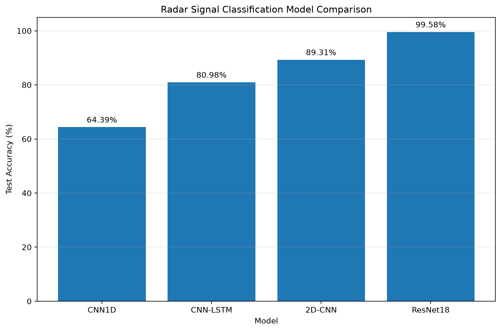
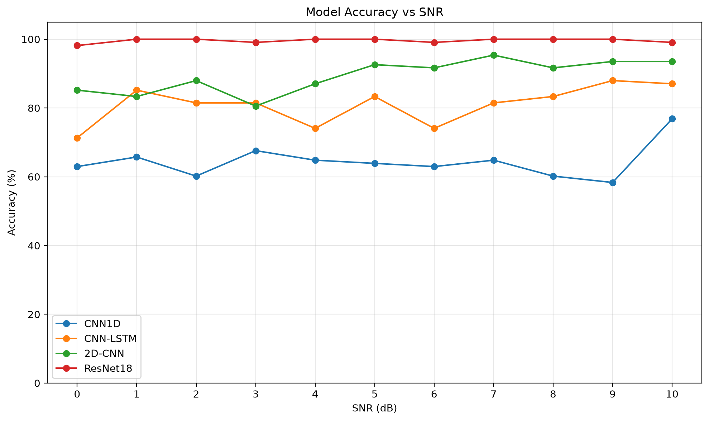

# RadarSignal

雷达脉内复合信号识别与参数测量毕业设计：仿真数据生成、四种深度学习模型对比、按类别参数估计、端到端分析和 PyQt5 桌面界面。

**本项目的实验结果来自当前仿真数据集，不代表真实雷达场景中的普遍性能。** 当前没有公开实测信号验证结果。

## 功能与处理流程

- 六类信号：LFM、BPSK、QPSK、LFM_BPSK、LFM_QPSK、2FSK_BPSK。
- 四个模型：CNN1D、CNN-LSTM 使用双通道 I/Q；2D-CNN、ResNet18 使用 STFT 时频图。ResNet18 为单通道适配结构，不使用 ImageNet 预训练权重。
- 参数测量：按信号类别估计中心频率、带宽、调频斜率/方向、码元数/速率、PSK 码序列、FSK 双频与跳频序列等，并与仿真真值比较。
- 端到端 pipeline：I/Q 归一化 → STFT → ResNet18 六分类 → 对应参数估计器 → 结构化结果。
- PyQt5 GUI：加载/随机选择测试样本、显示 I/Q 与时频图、识别概率与参数误差、导入外部 IQ、导出文本分析报告。

## 已有实验结果

| 模型 | 测试准确率 |
| --- | ---: |
| CNN1D | 64.39% |
| CNN-LSTM | 80.98% |
| 2D-CNN | 89.31% |
| ResNet18 | 99.58% |

数值对应 [现有评估汇总](outputs/comparison/model_accuracy_comparison.csv)，来自一次已有实验，整理期间没有重新训练。不同硬件、运行环境和训练随机性可能导致复现结果不同。





图表复制自现有 `outputs/comparison/`，重新评估后可同步更新。尚未提供 GUI 截图。

## 数据集

详见 [dataset_info.json](data/dataset_info.json)。随机种子 2026，采样率 20 MHz，每条 2048 点（102.4 μs），SNR 为 0–10 dB 的整数。每类每个 SNR 120 条，共 7920 条；按每个类别/SNR 组划分训练/验证/测试集为 84/18/18 条，总计 5544/1188/1188 条。

数据包含 I/Q、类别、SNR、参数真值、PSK 码序列及 FSK 序列等字段。数据集二进制文件不随源码提交，可由脚本生成。

## 安装与快速运行

所有命令从项目根目录执行。已验证本地环境为 Windows、Python 3.14.6；`requirements.txt` 记录实际安装的直接依赖版本，不是全部间接依赖锁文件。其他 Python 版本与操作系统尚未验证。

```bash
python -m venv .venv
```

Windows PowerShell 激活：`.\.venv\Scripts\Activate.ps1`；Linux/macOS 激活：`source .venv/bin/activate`。

```bash
python -m pip install -r requirements.txt
python dataset/generate_dataset.py
python dataset/check_dataset.py --no-show
python train/train_resnet18.py
python gui/main_window.py
```

数据生成会覆盖 `data/` 中同名数据集；训练会写入对应模型权重和训练历史，请先保留需要的实验版本。训练配置位于各训练脚本顶部，默认可自动选择 CUDA 或 CPU；CPU 训练可能较慢。

本机 PyTorch 为 `2.13.0+cu130`、torchvision 为 `0.28.0+cu130`；依赖文件省略本机 CUDA 后缀，不强制所有机器安装同一种 CUDA 构建。需要 GPU 时应安装与本机驱动兼容且相互匹配的 PyTorch/torchvision 构建。这里未验证全新环境联网安装。

**GUI 启动需要 `data/test.npz` 和 `outputs/models/resnet18_best.pth`。** 即使只想导入外部 IQ，目前也必须先准备测试集。训练 ResNet18 即可生成该权重；仓库尚未附带预训练权重下载地址。

## 四模型训练与评价

```bash
python train/train.py
python train/train_cnn_lstm.py
python train/train_cnn2d.py
python train/train_resnet18.py

python evaluation/evaluation_cnn1d.py
python evaluation/evaluation_cnn_lstm.py
python evaluation/evaluation_cnn2d.py
python evaluation/evaluation_resnet18.py
python comparison/compare_models.py
```

评价脚本读取相应模型权重，并绘制混淆矩阵、SNR 准确率及训练曲线。部分脚本需要对应的 `outputs/training/*_history.pt`，因此完整复现应先完成训练；仅有权重时可先运行下面的 pipeline 示例。绘图窗口需关闭后脚本才继续。

## 参数测量与完整流水线

```bash
python evaluation/evaluate_lfm_parameters.py
python evaluation/evaluate_psk_parameters.py
python evaluation/evaluate_lfm_psk_parameters.py
python evaluation/evaluate_fsk_bpsk_parameters.py
python evaluation/test_full_pipeline.py
python evaluation/evaluate_full_pipeline.py
python comparison/final_summary.py
```

独立参数评价使用测试集；完整 pipeline 还需 ResNet18 权重。最终汇总依赖前面的分类、参数及 pipeline 评价输出。`test_full_pipeline.py` 是抽样演示脚本，不是覆盖全部功能的自动化测试集。

Python 调用示例（`signal` 为 2048 点复数 I/Q，`fs` 单位 Hz）：

```python
from pipeline.radar_pipeline import load_classifier, analyze_signal

model = load_classifier()
result = analyze_signal(signal, fs, model)
print(result["classification"])
print(result["parameters"])
```

## 外部 IQ 格式

GUI 支持 `.npy` 和 `.npz`，每次分析一条长度为 **2048** 的信号：

| 数组形式 | 含义 |
| --- | --- |
| 复数 `(2048,)` | 实部为 I，虚部为 Q |
| 实数 `(2, 2048)` | 第一行为 I，第二行为 Q |
| 实数 `(2048, 2)` | 第一列为 I，第二列为 Q |

NPZ 按顺序寻找 `signal`、`iq`、`IQ`、`x`、`X` 字段；当 `X` 为三维数据集时只读取第一条。可选标量 `fs` 的单位为 Hz。没有 `fs`（包括 NPY）时，导入前在 GUI 中填写实际采样率，界面单位为 MHz。输入不应包含 NaN/Inf。

```python
import numpy as np

np.savez("example_iq.npz", signal=signal.astype(np.complex64), fs=20_000_000.0)
```

也可运行 `python evaluation/export_test_iq.py`，从测试集导出第 500 号样本到 `external_test_signal.npy`。脚本会覆盖该同名示例文件。外部文件无真值，不展示真实参数误差。

GUI 不会自动截断、补齐或重采样。修改采样率只影响参数测量/显示，不能让训练于 20 MHz 仿真数据的分类器自动适配其他采样条件。

## 项目结构

```text
RadarSignal/
├── assets/          # README 展示图
├── data/            # 数据说明；NPZ 本地生成
├── dataset/         # 仿真生成、数据检查、Dataset/STFT
├── models/          # 四种网络结构
├── train/           # 训练入口
├── estimation/      # 各类别参数估计
├── evaluation/      # 分类/参数/端到端评价与 IQ 导出
├── comparison/      # 模型对比与实验汇总
├── pipeline/        # ResNet18 分类与参数估计联动
├── gui/             # PyQt5 界面
├── outputs/         # 本地权重、训练记录及可公开评估图表
├── .gitignore
├── requirements.txt
└── README.md
```

项目和 GitHub 仓库建议命名为 `RadarSignal`。代码通过脚本位置定位根目录，不依赖文件夹名称；已有本地目录可继续使用，避免影响 IDE 的历史入口。

## GitHub 提交范围

保留源码、README、requirements、数据说明、`assets/`、评估 PNG 和汇总 CSV。`.gitignore` 排除 IDE 配置、缓存、虚拟环境、数据集、模型权重、训练历史、逐样本结果和默认分析报告；它不会删除本机文件。不要将整个目录直接打包公开。

| 内容 | 当前约占空间 | 处理 |
| --- | ---: | --- |
| `data/*.npz` | 119.76 MB | 忽略，由生成脚本重建 |
| `outputs/models/` | 47.95 MB | 忽略；如需分发，可另行发布权重 |
| `outputs/training/` | 0.01 MB | 忽略，训练时生成 |
| 其余 `outputs/` | 4.11 MB | 保留图表/汇总 CSV；忽略逐样本结果 |

空间按十进制 MB 估算。导出的外部 IQ 和报告应单独检查内容及文件名；自定义文件名的报告未必命中默认忽略规则。若文件已经被 Git 跟踪，新增忽略规则不能清除其历史记录。提交前应检查暂存区，确认没有数据、权重、IDE 配置或私人文件。

## 限制与许可

- 当前为闭集六分类，不支持未知信号拒识；置信度不是分类正确率保证。
- 参数估计依赖类别判定和仿真假设，误分类会传递到参数结果；码序列对比涉及相位模糊与对齐。
- 不包含真实接收链路、信道复杂失真和跨设备泛化的系统验证。
- 当前未添加 LICENSE，许可证及第三方材料的分发权限需由作者确认；公开仓库本身不等于授予开源使用许可。
